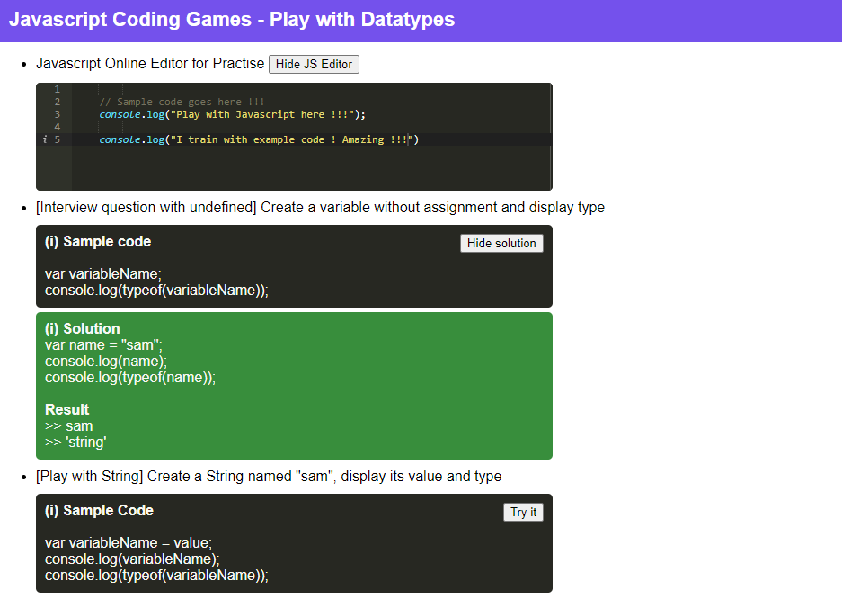

# [Awesome Javascript Examples for Interviews](https://www.javascript.com/)  

Learn javascript using the best samples code to success during interviews.

Lots of topics covered out there:
* Basic javascript types (string, number, ...) 
* Tests of types using typeof
* Objects 
* Operators 
* Comments
* local vs global variables 
* string methods
* regex 
* functions (explicit + anonymous)
* Inheritance
* Callback (to pass function as argument)
* Callback vs Promise vs async await to show all coding styles

## References
* [Visual Studio Code](https://code.visualstudio.com/) - The best code editor ever for Javascript 
* [Javascript ECMAScript 2015](https://262.ecma-international.org/6.0/) - Language Specification for Javascript ES5
* [Mozilla Javascript Examples](https://developer.mozilla.org/fr/docs/Learn/Getting_started_with_the_web/JavaScript_basics) - Getting started with HTML, CSS and Javascript
* [W3 Javascript Examples](https://www.w3schools.com/js/) - Getting started with Javascript with W3 Schools

## Overview

## Usage (Open index.html in your browser)
    cd demo-datatypes/ 
    firefox index.html

## Copyright

Copyright (c) 2022 Aissam Ahbar. See [LICENSE](https://github.com/aissam-ahbar/javascript/blob/main/README.md) for details.